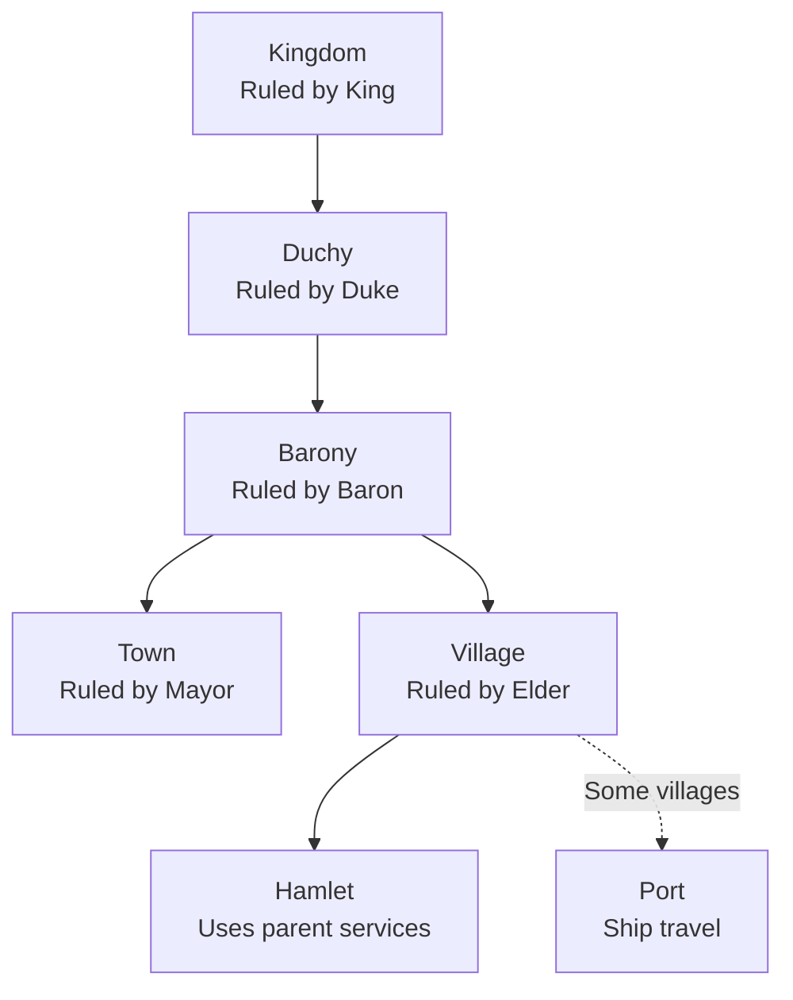
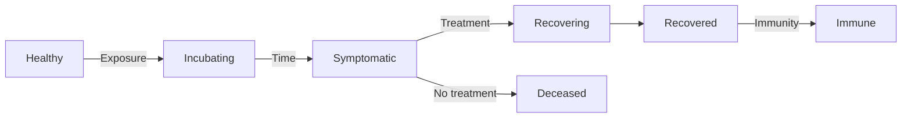

# Myrefell

A persistent browser-based medieval MMO where players and NPCs live together in a living simulation. Train combat stats, run businesses, found guilds, participate in elections, and rise through a feudal hierarchy from peasant to king.

> **"A medieval analogue to eRepublik - player-driven society with RPG training."**

## Tech Stack

| Component | Technology |
|-----------|------------|
| Backend | Laravel 12 (PHP 8.2+) |
| Frontend | React 19 + TypeScript |
| Full-Stack | Inertia.js |
| Styling | Tailwind CSS 4 + Radix UI |
| Database | PostgreSQL 18 |
| Cache/Sessions | Redis |
| Authentication | Laravel Fortify (with 2FA) |
| Build Tool | Vite 7 |
| Testing | Pest 4 |
| DevOps | Docker Compose / Laravel Sail |

## Features

### Player System
- **Combat Stats**: Attack, Strength, Defense (train daily at training grounds)
- **9 Skills**: Mining, Fishing, Woodcutting, Cooking, Smithing, Crafting, Foraging, Combat, Riding
- **Resources**: HP, Energy (regens 1/5min), Gold
- **Equipment**: 9 slots (head, chest, legs, feet, hands, weapon, shield, ring, amulet)
- **28-slot inventory** with stackable items and perishable tracking

### World Hierarchy



- **8 Biomes**: Forests, Plains, Mountains, Swamps, Desert, Tundra, Coastal, Volcano
- **Port Villages**: Coastal settlements with harbors for cross-kingdom ship travel

### Living World

The world runs on a calendar system with time passing automatically:

- **Calendar**: 4 seasons × 12 weeks = 48-week year (1 real day = 1 game week)
- **Seasons affect**: Travel speed, gathering yields, food decay, market prices, disaster frequency
- **NPCs live full lives**: Age, marry, have children, and die naturally
- **Food consumption**: Weekly food drain from granaries; starvation if empty
- **Resource decay**: Perishable items spoil over time (faster in summer)
- **Disease outbreaks**: Spread through settlements, quarantine to contain
- **Natural disasters**: Fires, floods, storms damage buildings and cause casualties

### Political System
- **Democratic elections** for village roles, mayors, and kings
- **Electable roles**: Elder, Blacksmith, Merchant, Guard Captain, Healer
- **Vote of no-confidence** to remove leaders
- **Title progression**: Peasant → Knight → Lord → King

### Social Classes

Medieval feudal class system with rights and restrictions:

| Class | Rights | Restrictions |
|-------|--------|--------------|
| **Serf** | Basic protection | Cannot vote, cannot travel freely, bound to land |
| **Freeman** | Vote, own property, travel | Must pay taxes, military service |
| **Burgher** | Vote, guilds, business ownership | Higher taxes, town residence required |
| **Noble** | Vote, high office, land ownership | Knight service to king |
| **Clergy** | Vote in church, exempt from some laws | Cannot hold secular office |

**Class Mobility:**
- Serfs can earn freedom through baron's decree, military service, or purchase (100k gold)
- Freemen can petition for nobility through royal decree, service, marriage, or purchase (1M gold)
- Manumission requests reviewed by barons; ennoblement by kings

### Law & Crime

Full justice system with courts, trials, and punishments:

**Crime Types:**
- Minor: Theft, Trespassing
- Moderate: Assault, Fraud, Smuggling, False Accusation
- Major: Murder, Desertion
- Capital: Treason
- Religious: Heresy

**Court Hierarchy:**
| Court | Jurisdiction | Judge |
|-------|--------------|-------|
| Village Court | Minor crimes | Elder |
| Baron's Court | Moderate crimes | Baron |
| Royal Court | Major crimes, appeals | King |
| Church Court | Religious crimes | High Priest |

**Punishments:** Fine, Imprisonment, Exile, Outlawry (kill on sight), Execution

**Bounty System:** Post bounties on outlaws, claim rewards for capture

### Religion & Cults

> "Religions create loyalty that competes with political loyalty."

Non-territorial power structures that overlay the political hierarchy. Players may have to choose between their King and their God.

**Cults** (Secret):
- Founded by 5+ players for free
- Hidden membership, can infiltrate governments
- 2 beliefs with powerful dark bonuses
- High-risk, high-reward gameplay
- Can upgrade to a public Religion

**Religions** (Public):
- Require 15+ followers and 100,000 gold to upgrade from cult
- Up to 5 beliefs with bonuses and penalties
- Build structures: Shrines (50K), Temples (500K), Cathedrals (5M gold)
- Religious ranks: Prophet → High Priest → Priest → Acolyte → Follower

**Beliefs** provide bonuses with tradeoffs:
- Combat: Blood Oath (+15% damage, -10% healing), Warrior's Path (+10% combat XP, -10% crafting)
- Economy: Merchant Faith (+10% trade profits, -5% combat), Ascetic Vow (+15% crafting XP, max 1K gold)
- Dark/Cult-only: Shadow Pact (invisible while traveling, -25% HP), Death Cult (keep 50% gold on death)

**Political Integration**:
- Kingdoms can adopt a state religion for tax bonuses and happiness
- Kingdoms can ban religions, forcing followers underground or into exile
- Barony jails hold persecuted followers and criminals
- Faith points earned through prayer, donations, conversions, and pilgrimages

### Economy

**Dynamic Markets**:
- Supply/demand pricing per location (no global auction house)
- Seasonal modifiers (food expensive in winter, cheap at harvest)
- Buy/sell spread with transaction history
- Must travel to trade between settlements

**Player Businesses**:
- Own workshops, farms, mines, inns
- Hire NPCs with wages and efficiency tracking
- Business treasury, reputation, and transaction logs
- Categories: production, service, extraction

**Employment**:
- Work jobs at locations (up to 2 concurrent jobs)
- Job requirements (skills, social class, etc.)
- Work shifts for gold wages
- Supervisor roles with cut of worker output
- Quit anytime, find new work elsewhere

**Player-Run Guilds**:
- Found guilds at towns (5+ members, 50k gold)
- Ranks: Apprentice → Journeyman → Master → Guildmaster
- Guild treasury, dues, elections, and benefits
- Price controls for monopoly guilds

**Core Systems**:
- Bank accounts per location with deposit/withdrawal tracking
- Tax system: Players → Villages → Baronies → Kingdoms
- Role salaries for elected officials
- No-confidence votes to remove leaders

### Combat & Dungeons

**Turn-Based Combat**:
- Fight monsters in the wilderness with training style selection (ATK/STR/DEF)
- Weapon effectiveness varies by enemy type
- Monsters drop gold and loot based on loot tables
- Death respawns at hospital with 25% energy

**Dungeons**:
- Multi-floor instanced content with increasing difficulty
- Multiple monster fights per floor
- Eat food between rounds to restore HP
- Boss fight on final floor with best loot
- Minimum combat level requirements

### Warfare System

**Armies**:
- Recruit soldiers when at settlements
- Manage army morale and supply lines
- View unit composition with attack/defense stats
- Issue movement orders to nearby settlements
- Track battle history per army

**Wars**:
- Declare war with a casus belli (claim, conquest, etc.)
- Track war scores for attackers vs defenders
- Manage participant lists and contribution scores
- Set war goals with completion tracking
- Siege settlements and fight field battles

**Battles**:
- Day-by-day battle log with casualty details
- Terrain and weather modifiers affect outcomes
- Track morale, initial strength, and remaining forces
- Commander bonuses for both sides

**Peace Negotiations**:
- Negotiate treaty terms with war score leverage
- Territory transfer options
- Gold payment demands
- Truce duration settings
- Acceptance likelihood calculation

### Dynasty & Marriage

**Dynasties**:
- Found a dynasty to track your lineage
- View prestige, rank, and living members
- Manage succession settings (primogeniture, ultimogeniture, etc.)
- Designate heirs and track generations
- Visual family tree with marriage connections

**Marriage**:
- Propose marriages between dynasty members
- Set dowry amounts and write proposal messages
- Accept, reject, or withdraw proposals
- Marriage history tracking
- Strategic alliances through marriage

### Trade & Caravans

**Caravans**:
- Hire caravans to transport goods between settlements
- Load/unload goods with quantity selection
- Track caravan status (loading, in transit, arrived)
- Event log showing bandit attacks, weather delays
- Progress bars for in-transit caravans

**Tariffs**:
- Set tariff rates (0-50%) on trade routes through your territory
- Per-item or general tariff rates
- Revenue tracking (weekly, monthly, total)
- View routes passing through your settlements

### Events & Festivals

**Festivals**:
- Attend festivals as attendee, performer, or vendor
- Participate in festival activities
- Earn festival bonuses during events
- Date-based progression (scheduled → active → completed)

**Tournaments**:
- Register for tournament competitions
- Visual bracket display showing matchups
- Track competitors and their progress
- Withdraw from tournaments if needed

### Buildings

**Construction**:
- View existing buildings and their condition
- Start new construction projects with resource requirements
- Track construction progress
- Repair damaged buildings
- Cancel in-progress construction

### Chat System
- **Location chat**: Talk with players in your village, barony, or kingdom
- **Private messaging**: Direct player-to-player communication
- **Moderation tools**: Elders, Barons, and Kings can moderate their jurisdiction

### Charter System

Found new settlements and expand the world:
- **Cost**: 1,000,000+ gold to petition for a charter
- **Requirements**: Location approval from controlling Baron/King
- **Signatories**: Gather support from other players
- **Vulnerability window**: New settlements are vulnerable after founding
- **Failure**: Abandoned settlements become explorable ruins

### Horses & Stables

Travel faster with your own mount:

- **Purchase horses** at stables (varies by location type)
- **Horse types** with different speed multipliers and stamina
- **Stable your horse** at locations to let it rest and recover
- **Stamina system**: Horses tire during travel, rest to restore
- **Custom naming** for your loyal steed
- **Sell horses** when you need gold (depreciated value)

### Disease & Health



**Outbreaks**:
- Diseases spread through settlements
- Contagious diseases spread between residents
- Outbreak severity: Emerging → Active → Declining → Ended

**Infections**:
- Incubation period before symptoms appear
- Treatment improves recovery chances
- Mortality risk for untreated severe cases
- Recovery grants immunity

**Quarantine**:
- Leaders can issue quarantine orders
- Reduces disease spread by 70%
- Track quarantine status and lift when safe

### Sea Travel (Ports)

Cross-kingdom travel by ship:

- **Port villages** offer ship passage to other kingdoms
- **Dynamic pricing** based on distance (base cost + gold per minute)
- **No land travel** required between distant kingdoms
- **Each kingdom** has its own harbormaster

### Blessings

Priests can grant divine blessings:

- **Prayer skill** unlocks more powerful blessings
- **Blessing categories**: Combat, crafting, travel, protection
- **Duration-based effects** with gold/energy costs
- **Request blessings** from priests at shrines/churches
- **Multiple active blessings** with stacking effects

### Natural Disasters

Random events that threaten settlements:

- **Seasonal disasters**: Some only occur in certain seasons
- **Severity levels**: Affects damage dealt
- **Building damage**: Structures can be damaged or destroyed
- **Casualties**: NPCs may perish in severe disasters
- **Protective buildings**: Some structures reduce disaster impact
- **Repair costs**: Gold required to restore damaged buildings

### Gameplay
- **Daily Tasks**: Combat, gathering, crafting, and service tasks with gold/XP rewards
- **Quests**: Accept up to 5 quests with various objectives and rewards
- **Gathering**: Mining, fishing, woodcutting in the wilderness
- **Crafting**: Smithing, cooking, and general crafting with recipes
- **Crafting Docket**: Player crafters can accept orders; NPC crafting available for instant (but costlier) results
- **Travel**: Move between locations with energy cost and travel time (horses speed this up!)
- **Healing**: Village healers and town/barony infirmaries treat injuries and diseases

## Requirements

- PHP 8.2+
- Node.js 20+
- PostgreSQL 18+
- Redis
- Composer
- npm

## Installation

### Using Docker (Recommended)

```bash
# Clone the repository
git clone git@github.com:djasnowski/myrefell.git
cd myrefell

# Copy environment file
cp .env.example .env

# Start containers
docker compose up -d

# Install dependencies and setup
docker compose exec app composer setup
```

### Manual Setup

```bash
# Clone the repository
git clone git@github.com:djasnowski/myrefell.git
cd myrefell

# Install PHP dependencies
composer install

# Install Node dependencies
npm install

# Copy environment file and generate key
cp .env.example .env
php artisan key:generate

# Configure your database in .env, then run migrations
php artisan migrate

# Build frontend assets
npm run build
```

## Development

```bash
# Run the full development stack (server, queue, logs, vite)
composer dev

# Or run components individually:
php artisan serve          # Laravel server
npm run dev                # Vite dev server
php artisan queue:listen   # Queue worker
php artisan pail           # Log viewer
```

### Available Commands

```bash
# Development
composer dev              # Full dev environment with hot reload
composer dev:ssr          # Dev with server-side rendering

# Code Quality
composer lint             # Format PHP code with Pint
composer test:lint        # Check PHP formatting
npm run lint              # Fix JS/TS with ESLint
npm run format            # Format with Prettier
npm run format:check      # Check Prettier formatting
npm run types             # TypeScript type checking

# Testing
composer test             # Run all tests
php artisan test          # Run PHP tests only

# Build
npm run build             # Production build
npm run build:ssr         # Production build with SSR
```

## Project Structure

```
app/
├── Actions/Fortify/      # Auth actions (registration, password reset)
├── Http/Controllers/     # Request handlers
├── Models/               # Eloquent models (User, Village, Kingdom, etc.)
├── Services/             # Business logic (Energy, Travel, Quest, etc.)
└── Jobs/                 # Background jobs (elections, energy regen)

resources/js/
├── components/           # Reusable React components
│   └── ui/              # Base UI components (buttons, cards, etc.)
├── hooks/               # Custom React hooks
├── layouts/             # Page layouts (app, auth, settings)
├── lib/                 # Utilities and helpers
├── pages/               # Inertia page components
└── types/               # TypeScript type definitions

database/
├── migrations/          # Database schema
├── factories/           # Model factories for testing
└── seeders/             # Development data seeders
```

## Testing

```bash
# Run all tests with linting
composer test

# Run tests only
php artisan test

# Run specific test file
php artisan test tests/Feature/Auth/AuthenticationTest.php
```

## Docker Services

| Service | Port | Description |
|---------|------|-------------|
| app | 80 | Laravel application |
| pgsql | 5432 | PostgreSQL database |
| redis | 6379 | Cache and sessions |
| mailpit | 8025 | Email testing UI |

## Environment Variables

Key environment variables to configure:

```env
APP_URL=http://localhost
DB_CONNECTION=pgsql
DB_HOST=pgsql
DB_DATABASE=myrefell
CACHE_STORE=redis
SESSION_DRIVER=redis
QUEUE_CONNECTION=database
```

## License

MIT
